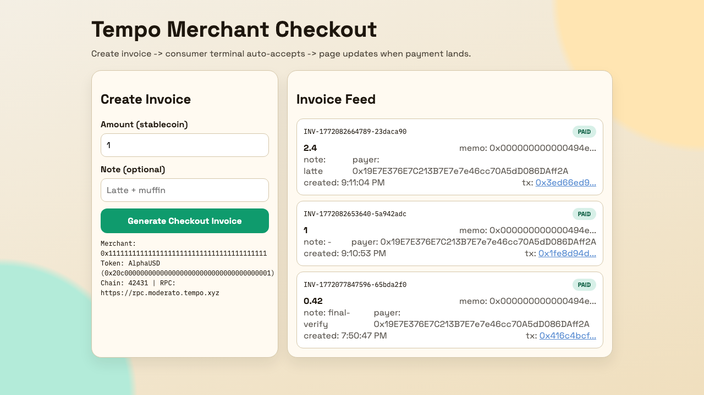

# Tempo Payment Demo

Real-time Tempo testnet payment demo with two apps:

- `merchant-checkout`: web checkout that creates invoices and marks them paid from on-chain logs.
- `consumer-terminal`: terminal agent that listens for new invoices and pays with `transferWithMemo`.

Reference docs:

- [Send a Payment](https://docs.tempo.xyz/guide/payments/send-a-payment)
- [Accept a Payment](https://docs.tempo.xyz/guide/payments/accept-a-payment)

## What this demonstrates

- Invoice creation with deterministic memo correlation (`bytes32` memo per invoice).
- Live payment acceptance from a second app.
- Merchant reconciliation from Tempo chain logs without page refresh.

## Live screenshot

Merchant checkout UI with paid invoices:



## Architecture

```text
merchant UI (browser)
  -> POST /api/invoices
merchant server (Express + WS)
  -> broadcasts invoice.created
consumer terminal (WS client)
  -> transferWithMemo(to, amount, memo)
Tempo testnet
  -> TransferWithMemo log
merchant watcher (getLogs polling)
  -> invoice.status = paid
  -> broadcasts invoice.paid
```

## Project layout

```text
tempo-realtime-checkout-demo/
  src/
    merchant/
      server.js          # HTTP + WS server + invoice APIs
      invoiceStore.js    # in-memory invoice model
      watcher.js         # on-chain log polling/reconciliation
      public/
        index.html       # checkout UI
        app.js           # UI state + websocket updates
    consumer/
      terminal.js        # auto-accept terminal payer
    shared/
      config.js          # env loading + validation
      chain.js           # viem chain/public client
      token.js           # token ABI/helpers
  .env.example
  package.json
```

## Prerequisites

- Node.js 20+
- Tempo testnet merchant address (`MERCHANT_ADDRESS`)
- Tempo testnet funded consumer private key (`CONSUMER_PRIVATE_KEY`)

Faucet reference:

- [Tempo Faucet](https://docs.tempo.xyz/quickstart/faucet)

## Configuration

```bash
cd /Users/fred/GPT-CODE/tempo-realtime-checkout-demo
cp .env.example .env
```

Set required values in `.env`:

- `MERCHANT_ADDRESS`: recipient merchant wallet
- `CONSUMER_PRIVATE_KEY`: payer key for testnet only

Important defaults:

- `TEMPO_RPC_URL=https://rpc.moderato.tempo.xyz`
- `TEMPO_CHAIN_ID=42431`
- `TEMPO_TOKEN_ADDRESS=0x20c0000000000000000000000000000000000001` (AlphaUSD test token)

Install deps:

```bash
npm install
```

## Run

Terminal A:

```bash
npm run merchant
```

Terminal B:

```bash
npm run consumer
```

Open:

- `http://127.0.0.1:8788`

## Demo flow

1. Create an invoice in checkout UI.
2. Consumer terminal receives `invoice.created` over WebSocket.
3. Consumer sends `transferWithMemo` on Tempo.
4. Merchant watcher reads `TransferWithMemo` logs and reconciles by memo + amount.
5. UI updates to `paid` in real time.

## Notes and caveats

- Invoice storage is in-memory only (no persistence).
- Merchant reconciliation intentionally uses `getLogs` block polling instead of RPC filter subscriptions for better compatibility.
- Event signature used for reconciliation:
  - `TransferWithMemo(address indexed from, address indexed to, uint256 value, bytes32 indexed memo)`
- Use testnet keys only.
